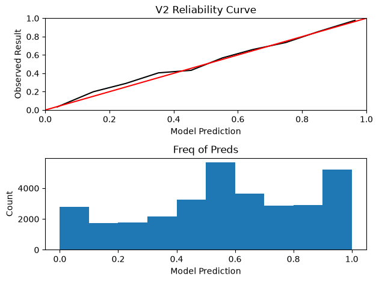

# WP Model

Simple Win Probability Modelling for the NBA(limited to the 2025/26 season)

scraper.py scrapes needed nba data using nba_api.

model.py trainings and evaluates logsitic regression model, and outputs a reliability diagram. features are margin, seconds_left and margin x seconds_left.

Current brier score is 0.165.

